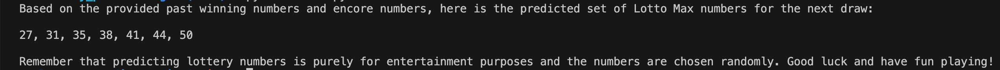

# 🎯 Lotto-Predictor

## Disclaimer

***This project is for entertainment and educational purposes only. It does not guarantee or improve your chances of winning the lottery.***

## 📌 Introduction
This Python project pulls historical Lotto Max winning numbers from the OLG API, then uses the OpenAI API to "predict" the next draw’s numbers—purely for fun and practicing Python skills.

## 📈 Sample Result


## ⚙️ Installation & Setup
1. Install the dependencies
`pip3 install -r requirements.txt`

2. Create a `.env` file in the root directory
`touch .env`

3. Put below in `.env` file
```
OPEN_AI_API_KEY=your_openai_key_here
X_CLIENT_ID=your_client_id_here
```
You can find the `X_CLIENT_ID` by checking the request headers when calling the [OLG API](https://gateway.wma.olg.ca/feeds/past-winning-numbers) on the [OLG Lotto Website](https://www.olg.ca/en/lottery/play-lotto-max-encore/past-results.html).

4. Run the project
`python3 main.py`

## 🧪 How It Works
 - Fetches one year of historical winning numbers from the OLG API.
 - Sends the numbers to OpenAI’s GPT model using a fun prompt.
 - Displays the AI-generated prediction in the console.

## 📄 License
This project is licensed under the Apache 2.0 or later License - see the LICENSE file for details.

## 👤 Author
Yixin Li

April 5, 2025